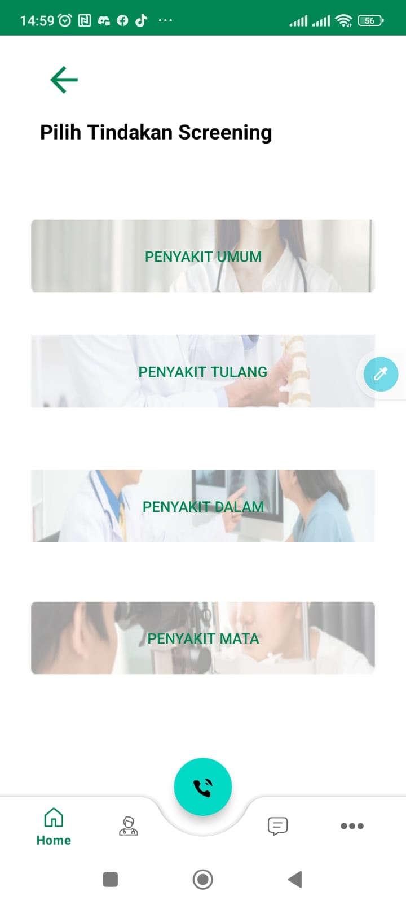
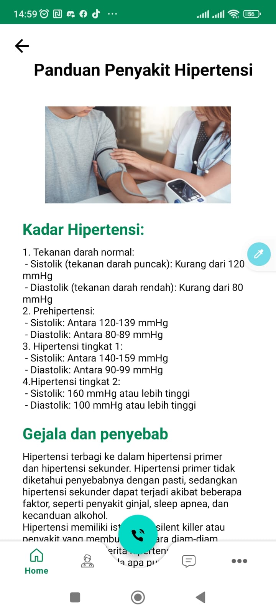
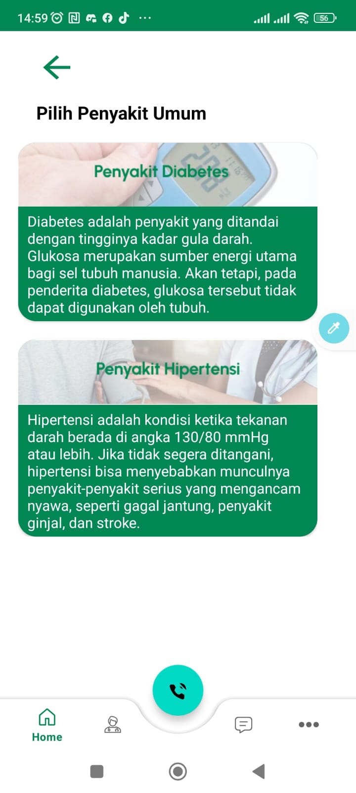
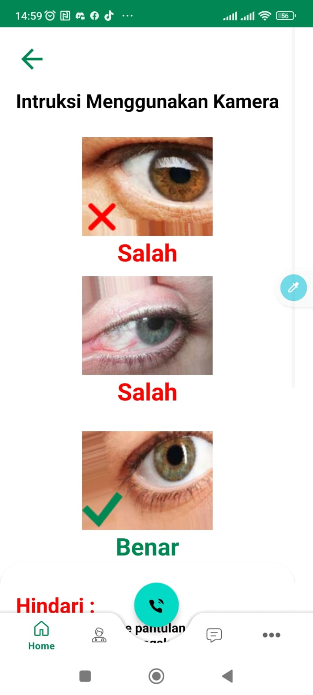
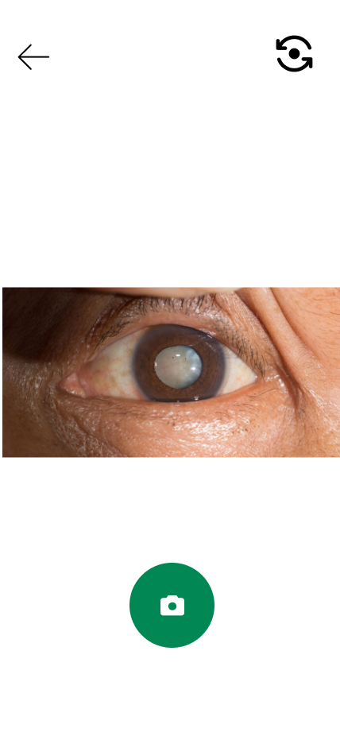
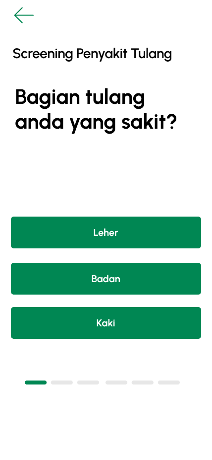

# SehatinAja

SehatinAja is an Android application that aims to facilitate users in accessing healthcare services easily. This application includes a screening or disease diagnosis feature, allowing users to identify their illnesses more conveniently and quickly.

## Features

- Login/Logout
- Register
- Screening/diagnosis disease
- List doctor (under development)
- medicine recomendation

## Screenshots

    
    
    
    
    
    
    
    
    
    
    

## Installation

1. Clone the repository: `git clone https://github.com/Serfee/Mobile-Development.git`
2. Open the project in Android Studio.
3. Build and run the application on your Android device or emulator.

##Depedencies

dependencies {

    implementation 'androidx.core:core-ktx:1.7.0'
    implementation 'androidx.appcompat:appcompat:1.6.1'
    implementation 'com.google.android.material:material:1.9.0'
    implementation 'androidx.constraintlayout:constraintlayout:2.1.4'
    implementation 'androidx.navigation:navigation-fragment-ktx:2.3.5'
    implementation 'androidx.navigation:navigation-ui-ktx:2.3.5'
    implementation 'androidx.camera:camera-lifecycle:1.2.3'
    testImplementation 'junit:junit:4.13.2'
    androidTestImplementation 'androidx.test.ext:junit:1.1.5'
    androidTestImplementation 'androidx.test.espresso:espresso-core:3.5.1'

    //CameraX
    implementation 'androidx.camera:camera-core:1.2.3'
    implementation 'androidx.camera:camera-camera2:1.2.3'
    implementation 'androidx.camera:camera-lifecycle:1.2.3'
    implementation 'androidx.camera:camera-view:1.2.3'

    //Material Desing
    implementation 'com.google.android.material:material:1.9.0'

    //Navigation

    //TensorFlowLite
    implementation 'org.tensorflow:tensorflow-lite:2.12.0'
    implementation 'org.tensorflow:tensorflow-lite-support:0.4.3'
    implementation 'org.tensorflow:tensorflow-lite-metadata:0.4.3'
    implementation 'org.tensorflow:tensorflow-lite-gpu:2.3.0'
    implementation 'com.google.android.gms:play-services-tflite-gpu:16.2.0'
    implementation 'com.google.mlkit:vision-common:17.3.0'

    //CardView
    implementation "androidx.cardview:cardview:1.0.0"

    //Retrofit
    implementation 'com.github.bumptech.glide:glide:4.11.0'
    implementation 'com.squareup.retrofit2:retrofit:2.9.0'
    implementation "com.squareup.retrofit2:converter-gson:2.9.0"
    implementation "com.squareup.okhttp3:logging-interceptor:4.9.0"

    //Firebase
    implementation 'com.firebaseui:firebase-ui-auth:7.2.0'
    implementation 'com.google.firebase:firebase-auth:21.0.4'

}
    
